# Vittam Bank Assistant

A RAG-powered banking assistant covering **17 Indian banks** (Indian Bank plus 16 public-sector and private peers) and **RBI regulatory guidance**, built as a Streamlit app on top of FAISS + Groq. It answers deposit, loan, and digital-banking questions bank-by-bank or across the whole market, and layers a set of analyst/customer tools (rate comparison, an EMI/maturity calculator, a "should I switch banks" comparator, and a banking-news feed) on top of the same real, sourced data.

This is a living document — it reflects what's actually built and verified as of **2026-09-14**, and will be revised as remaining work (see [Status & Roadmap](#status--roadmap)) completes.

📘 **[Engineering Deep Dive](PROJECT_DEEP_DIVE.md)** — how this system actually works, organized by topic (architecture, data flow, where the LLM is/isn't trusted, error handling, verification tools), including real bugs found and fixed along the way and the honest gaps still open. Written as a plain-language reference, not just a change log.

> **Not financial advice.** All rates, fees, and eligibility figures are compiled from publicly available bank and RBI sources for reference only. Always confirm directly with the relevant bank before acting on anything shown here.

---

## Key Features

**Chat**
- **General Chat** — ask a question with no bank named and get a cross-bank answer, built with round-robin selection so one bank's content can't crowd out the others.
- **Per-bank chat** — scope any question to one specific bank (all 17, grouped as Public Sector / Private).
- **RBI Guidelines** — a fast-lookup mode over 22 curated RBI documents (Master Directions, Citizens' Corner FAQs, current policy rates) for regulatory questions, tuned for precision over friendliness. Opens with a live **"What's New"** banner scraped directly from `rbi.org.in`'s own homepage ticker — real, current RBI notifications/press releases, not a stale summary of this app's own reference docs.

**Analyst & customer tools** (the "Insights & Tools" panel)
- **This Week's Changes** — a real rate-change digest (FD, home loan, education loan, vehicle loan) with peer-positioning context ("now 2nd highest among tracked PSBs"), also answerable directly via chat with zero LLM tokens spent. Checks both the 8 standard FD tenures and any real "special" tenure band (named schemes like 444/555/666-day deposits) that falls outside them.
- **Calculator** — FD maturity and loan EMI (home, education, vehicle), including proper moratorium-interest capitalization for education loans (a real ~43% EMI-understatement bug found and fixed) — vehicle loans skip the moratorium step entirely, since EMI starts immediately on disbursement. The loan rate is a plain editable field, not locked to whichever tier a bank publishes as its best case — enter your own actual approved rate for an accurate figure.
- **Should I Switch?** — compares a customer's actual current rate against the best available rate across all tracked banks, for FD, home loan, education loan, or vehicle loan, with a top-3 ranked result.
- **Latest Banking News** — live RSS feed (Economic Times + Business Standard banking sections), with an **Archive** sub-view — every headline this app has ever fetched, persisted in DuckDB, not just whatever the live feed still shows.
- **IBA News** — Indian Banks' Association circulars (wage settlements, Dearness Allowance/Relief, sector coordination) that RBI itself doesn't issue.
- **Banker View** — a 6th tab reframing the same real data for bank-staff use: Peer Positioning (auto-detected PSB-vs-PSB / Private-vs-Private comparison), Rate Movement, IBA Circulars, an Objection-Handling Lookup (now covering FD, Home, Education, and Vehicle Loan), and curated operationally-relevant RBI excerpts.

**Compare Rates** — a standalone side-by-side FD / home loan / education loan / vehicle loan comparison across all tracked banks. The FD tab's 8 standard tenures cover the common case; a collapsed **"Special / Additional Tenure Bands"** section below it separately lists real, substantial-duration bands (named schemes, unusual gaps) that don't fit any of the 8 — each shown with its own actual range, not forced into a nearest-tenure approximation.

**Coverage**
- All 17 banks have real, verified brand colors and dedicated content.
- Structured rate data (`fd_rates`, `loan_rates`) is fetched and parsed per-bank into DuckDB, kept as a source deliberately separate from the RAG text content — a real drift between the two (a structured rate updated, the matching chat-facing doc not re-synced) was found and fixed for HDFC; `automation/verify_coverage.py` now checks for this class of gap on an ongoing basis, not just content-exists/chat-can-find-it (see [Evaluation](#evaluation)).

---

## Walkthrough

Real screenshots captured directly from the running app (`streamlit run app.py`) — every figure shown below is a live query result, not a mockup.

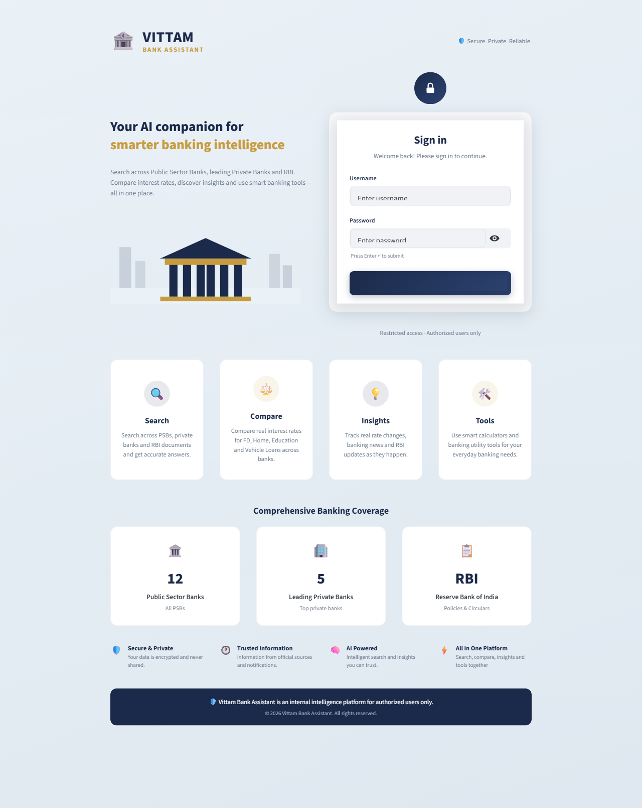
The sign-in screen — recolored to the app's own navy/gold palette (not a separate brand identity), real bank counts (12 PSBs, 5 private banks) read live, not hardcoded copy.

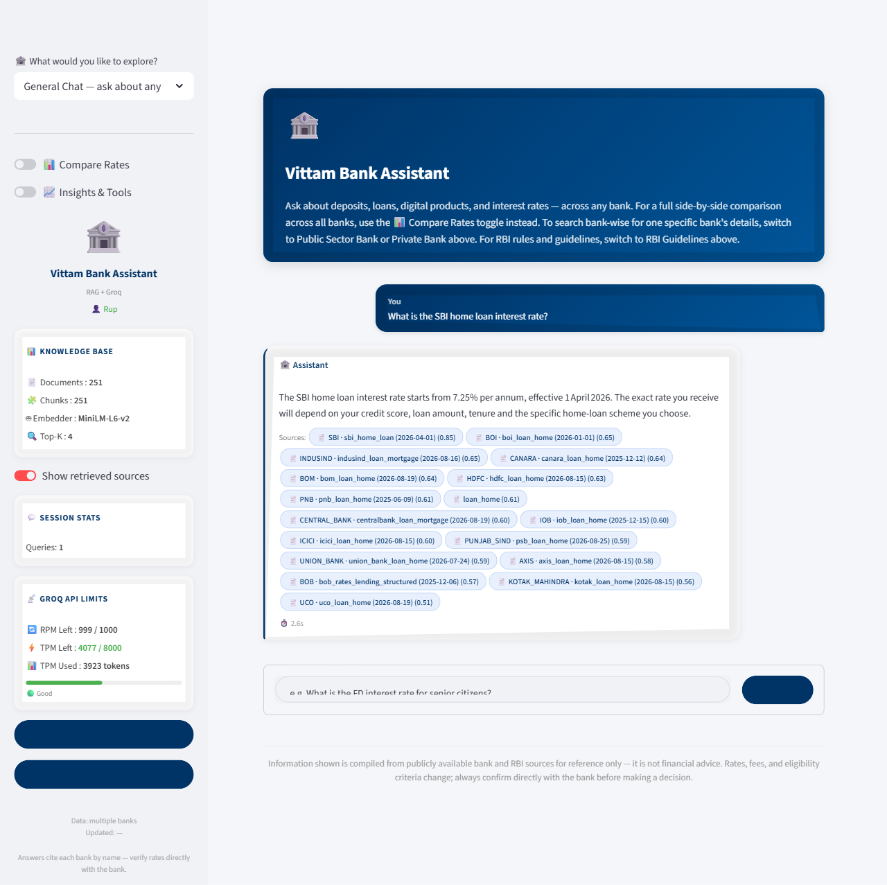
General Chat, sidebar bank/mode navigation on the left — a real answer with all 17 banks' relevant docs cited as sources.

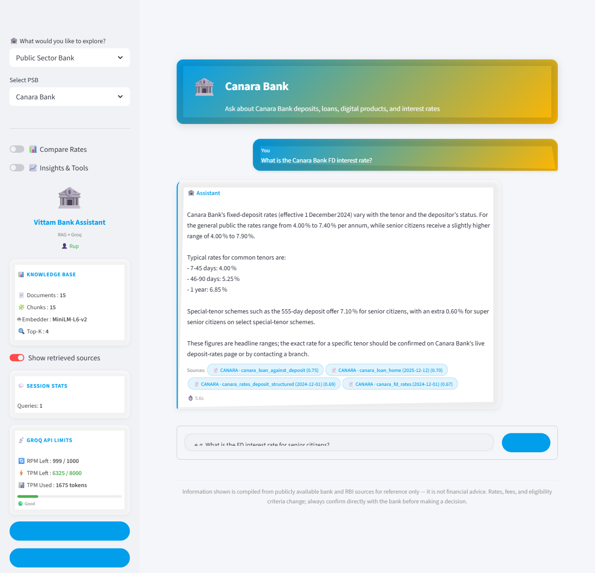
An individual bank profile (Canara Bank, blue/gold brand theme) scoped to that bank only, with a real cited answer.

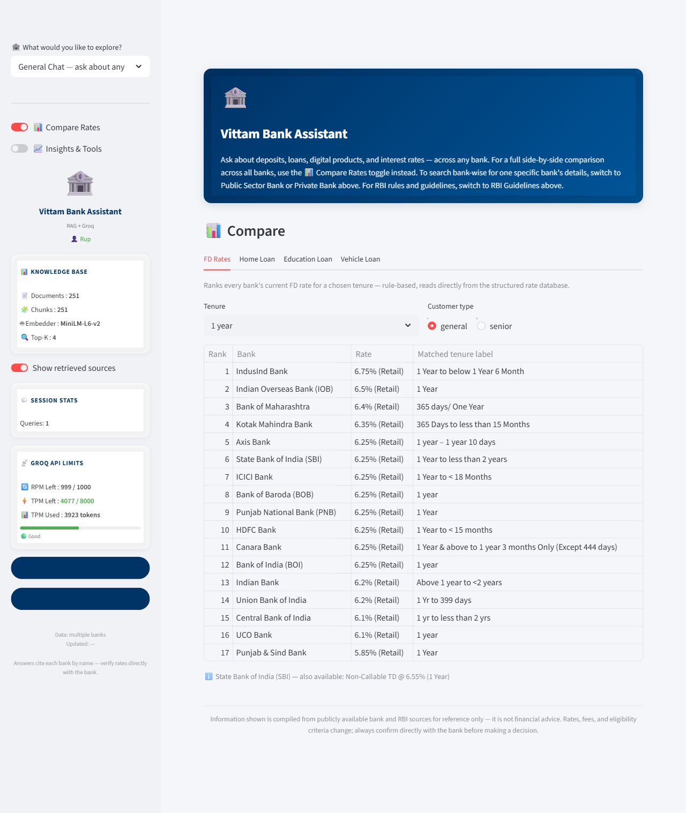
Compare Rates, FD Rates tab — every tracked bank ranked for a chosen tenure, reading directly from the structured rate database.

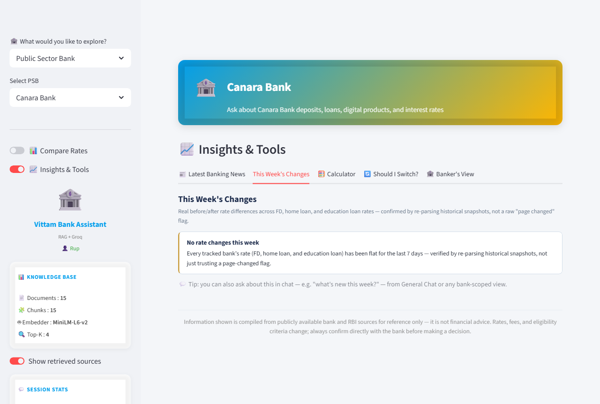
Insights & Tools — This Week's Changes: a real rate-change digest, re-parsed from historical snapshots rather than a raw "page changed" flag.

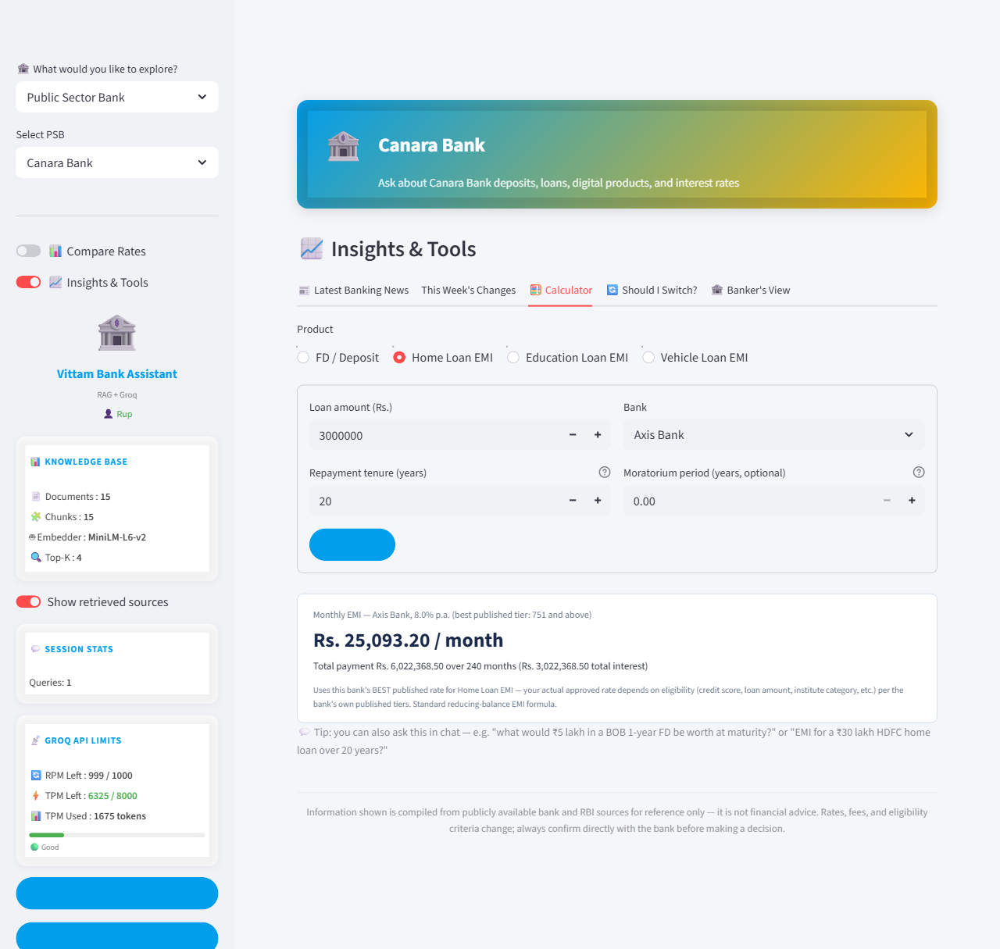
Insights & Tools — Calculator: a real EMI calculation (reducing-balance formula) for a live-selected bank and rate.

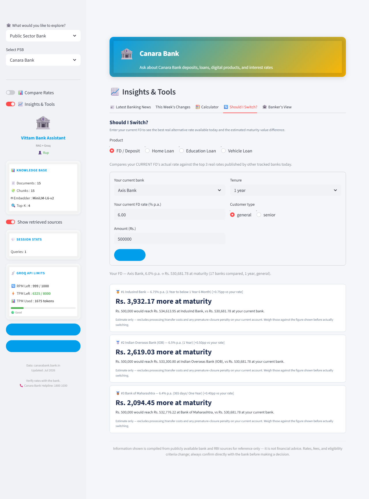
Insights & Tools — Should I Switch?: a customer's current FD ranked against the top 3 real alternatives available today.

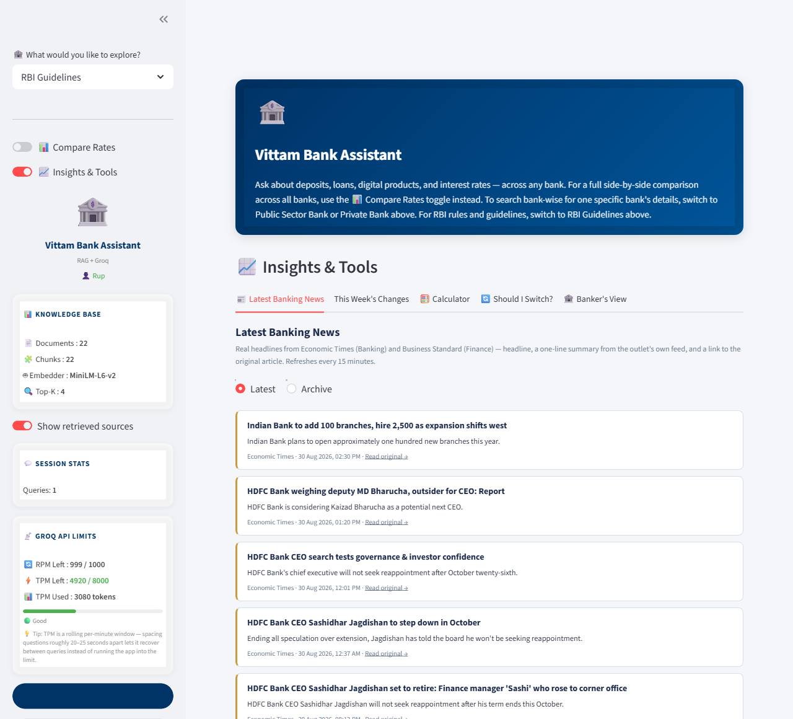
Insights & Tools — Latest Banking News: live RSS headlines from Economic Times and Business Standard, with the Latest/Archive sub-view (every headline ever fetched, persisted in DuckDB).

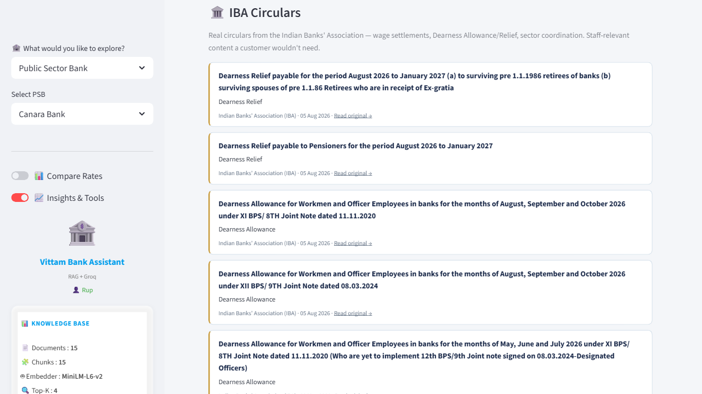
Banker's View — IBA Circulars: real Indian Banks' Association circulars (Dearness Allowance/Relief), staff-relevant content folded into Banker's View.

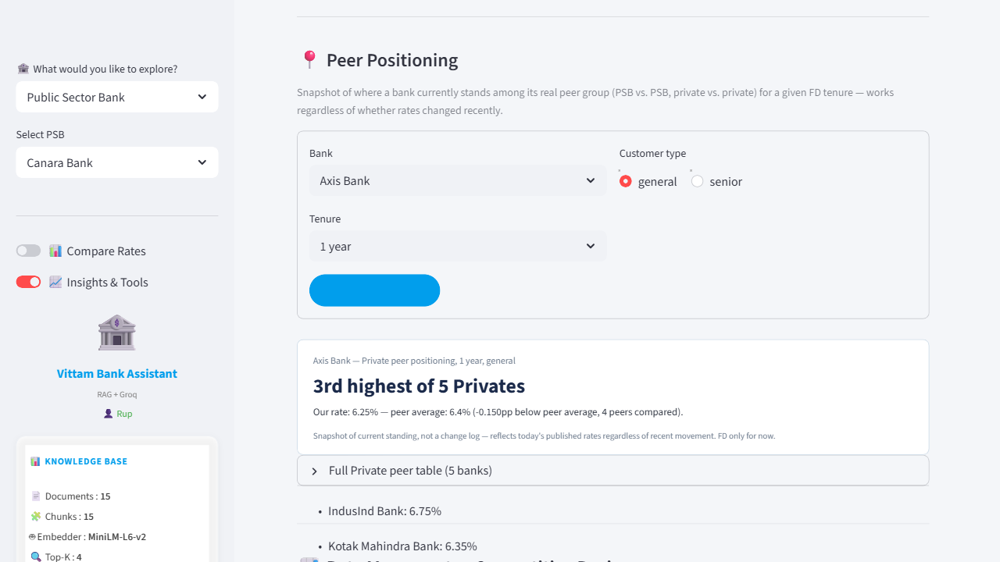
Banker's View — Peer Positioning: a real "3rd highest of 5 Privates" ranking against a bank's actual peer group.

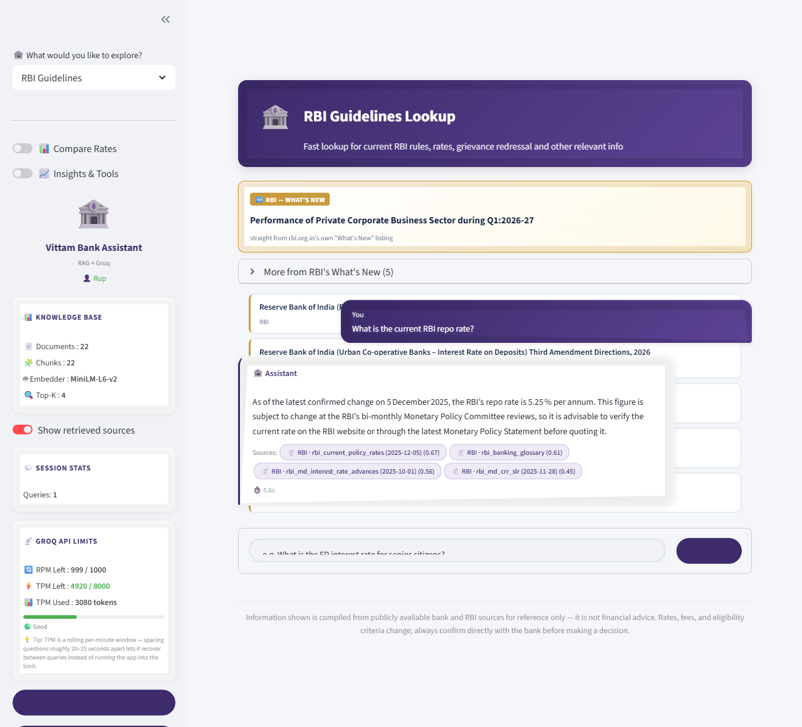
RBI Guidelines mode — the live "What's New" banner (scraped directly from rbi.org.in, real current item, no fixed dates fabricated) above a real policy-rate lookup against RBI's own Master Directions and current rates.

---

## Tech Stack

| Layer | Choice |
|---|---|
| UI | [Streamlit](https://streamlit.io) |
| LLM | [Groq](https://groq.com) (`openai/gpt-oss-20b`) |
| Retrieval | [FAISS](https://github.com/facebookresearch/faiss) (`faiss-cpu`) |
| Embeddings | `sentence-transformers` (`all-MiniLM-L6-v2`) |
| Structured data | DuckDB |
| Scraping / extraction | BeautifulSoup, Playwright, pdfplumber |
| Evaluation | [RAGAS](https://github.com/explodinggradients/ragas) (dev-only, not a runtime dependency) |

---

## Architecture

Three FAISS index pools, deliberately kept separate rather than merged into one:

```
indexes/
├── indian_bank.index / chunks.json        ← Indian Bank's original, protected legacy pool
├── other_banks.index / other_banks_chunks.json   ← the 16 other banks (~220 chunks)
└── rbi.index / rbi_chunks.json            ← RBI regulatory content (22 docs)
```

- **Indian Bank** runs on its own untouched legacy index — it predates the multi-bank extension and is kept structurally separate for stability, not because it's treated differently as a bank.
- **The other 16 banks** share one pool (`data/raw/<bank>/*.txt`, one folder per bank), tagged with `BANK` / `CATEGORY` / `SOURCE_TYPE` metadata so a single retrieval call can be scoped to one bank (`bank_filter`) or left open for General Chat.
- **RBI** is kept physically separate from "banks" — it's the regulator, not a peer, and its content needs a different tone (binding-rule language, not marketing copy).

Retrieval (`retrieve()` in `app.py`) does a FAISS similarity search, then filters to the requested bank/category. A structural fix applied 2026-08-25: when a specific bank is selected, the search now scans the *entire* index rather than a small fixed-size window — with 17 banks sharing one pool, a small window meant a bank's own well-written content could still lose to unrelated competition purely on window size, not content quality. See `automation/verify_retrieval.py` for the systematic check this was built to satisfy.

Structured rate data (`fd_rates`, `loan_rates` in DuckDB) is fetched and parsed independently of the RAG text content via `automation/fetch_and_track.py` + per-bank parsers in `automation/extract_structured.py` / `automation/extract_loan_rates.py`. The Calculator, Compare Rates, and Should-I-Switch tools all read from this structured DB, not from RAG retrieval — deterministic numeric answers instead of LLM-derived ones.

---

## Setup

**Requirements:** Python 3.11+ (developed/tested on 3.14), a [Groq API key](https://console.groq.com).

```bash
git clone <this-repo>
cd "Indian Bank Rag Project"
pip install -r requirements.txt
```

Copy `.streamlit/secrets.toml.example` to `.streamlit/secrets.toml` and fill in a real Groq API key plus at least one login account:

```toml
GROQ_API_KEY = "your-groq-api-key-here"

[allowed_users]
demo = "changeme"
```

`.streamlit/secrets.toml` is gitignored — never commit it with real values. (A `.env` file with `GROQ_API_KEY=...` also works as a fallback, mainly for running automation scripts standalone outside Streamlit; `st.secrets` is checked first when the app itself runs.)

Optional overrides (defaults shown, via `.env`):

```
GROQ_MODEL=openai/gpt-oss-20b
MAX_TOKENS=1200
EMBED_MODEL=all-MiniLM-L6-v2
TOP_K=4
```

Build the FAISS indexes (needed once, and again any time `data/raw/` content changes):

```bash
python build_index.py
python automation/rebuild_indian_bank_legacy_index.py
```

A rebuild while the app is already running is picked up automatically — Streamlit's cache is keyed to each index file's own modification time, so the very next rerun reloads it with no restart needed (confirmed by live-testing a real edit against a running server). Only genuinely new banks/products (which need `settings.py`/`app.py` changes, not just new `.txt` content) still need a restart. `automation/verify_index_freshness.py` (or the app's own sidebar, which runs the same check on every load) will flag it if an index ever falls behind its source files for any reason.

Run the app:

```bash
streamlit run app.py
```

Login accounts come from `.streamlit/secrets.toml`'s `[allowed_users]` table (see above) — add or change accounts there, never in source.

**Deploying (e.g. Streamlit Cloud):** the platform only runs `app.py` — it never runs the `automation/` fetch pipeline, so the structured-rate database (`data/automation.duckdb`) has to be shipped as a snapshot rather than generated on the server. That file is committed as one deliberate, narrow exception to the normal "don't commit the database" rule (see `.gitignore`'s comment on it). The FAISS indexes (`indexes/`) are committed too and already current as of this repo's last commit (`automation/verify_index_freshness.py` confirms 0/3 stale), so a fresh deploy needs no build step for either — `streamlit run app.py` (or the platform's equivalent) works immediately from a clean clone. **The live demo's rate data is therefore a periodically-refreshed snapshot, not a live feed** — the app's own sidebar says so, and the automation pipeline that actually keeps it current is meant to be run locally (see [automation/](automation/)), not on the deployed instance.

---

## Evaluation

Regenerating either evaluation artifact below needs the dev-only extras (`pip install -r requirements-dev.txt`) — not required to run the app itself.

### Primary: retrieval reliability (`verify_retrieval.py`)

The main evaluation evidence is a systematic, deterministic check: for every (bank, product category) pair, does asking that bank's own real question actually surface that bank's own real document? This is what the multi-session severe-gap-fixing effort (see `PROJECT_STATUS.md` §22–28) was built and measured against — no LLM call involved, so it's fast, reproducible, and free to re-run.

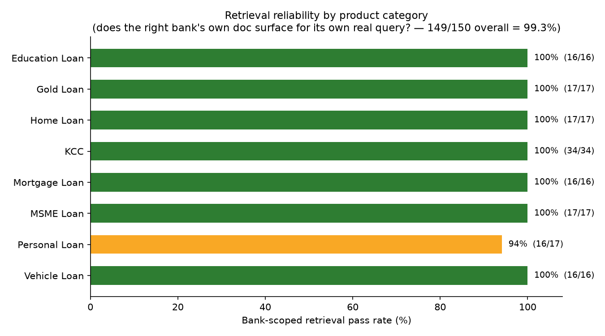

**149/150 bank-scoped checks pass (99.3%)** across 8 product categories and all 17 banks. The one fail (`indian_bank` / `personal_loan`) is a known, non-severe "wrong doc retrieved" case, not a zero-result failure — see [Known Limitations](#known-limitations).

Separately, `automation/verify_all.py` (does the retrieved content contain the *correct number*, for FD/home loan/education loan/vehicle loan across all 17 banks) is at **186/186 PASS** — a distinct check from retrieval competition, closer to "is the data itself correct."

A third tool, `automation/verify_coverage.py`, checks a different question again: can Compare/the digest actually *see* every real rate, or does a real band/change fall into a structural blind spot? Built after a real bug (a genuine HDFC senior FD rate move was invisible to both Compare's tenure picker and the rate-change digest, because both only ever checked 8 fixed tenure milestones). Currently **200/200 PASS** against live data.

A fourth, `automation/verify_index_freshness.py`, checks something none of the other three do: do the FAISS indexes on disk actually reflect the *current* content of their real source `.txt` files, or did someone edit a document and never re-run `build_index.py`? Pure filesystem-timestamp comparison, no embeddings or LLM calls — flags exactly which source file is newer than its index. The same check also runs live in the app's own sidebar on every page load (see `app.py`), so this doesn't only get caught when someone remembers to run the script by hand. Currently **3/3 PASS**.

Run all four together any time a bank or product is added:

```bash
python automation/verify_all.py
python automation/verify_retrieval.py
python automation/verify_coverage.py
python automation/verify_index_freshness.py
```

Regenerate the chart at any time with:

```bash
python automation/plot_eval_chart.py
```

### Supporting exhibit: RAGAS (independent-framework validation)

[RAGAS](https://github.com/explodinggradients/ragas) scores the *actual* chat pipeline end to end — real retrieval, a real Groq call through the exact same prompt template `app.py` uses, then independent LLM-judged scoring — on four axes: does the answer stay grounded in what was retrieved (**faithfulness**), does it actually address the question (**answer relevancy**), and is the retrieved context itself relevant and sufficient (**context precision** / **context recall**).

This is currently a small supporting sample (3 of a planned 24 test cases; Groq's daily quota interrupted the full run — see [Known Limitations](#known-limitations)):

| Bank | Question | Faithfulness | Answer Relevancy | Context Precision | Context Recall |
|---|---|:---:|:---:|:---:|:---:|
| SBI | Does this bank offer a Kisan Credit Card scheme? | 1.00 | 0.70 | 0.83 | 1.00 |
| PNB | Does this bank offer a Kisan Credit Card scheme? | 1.00 | 0.86 | 1.00 | 1.00 |
| Kotak Mahindra | Does this bank offer a Kisan Credit Card scheme? | 1.00 | 0.89 | 1.00 | 1.00 |

Faithfulness and context recall are perfect across all three — every real answer stayed grounded in retrieved content, and retrieval always surfaced what was needed. Answer relevancy and context precision are both strong with some real headroom. Treat this as a proof-of-pipeline-quality sample, not yet a statistically broad baseline.

Re-run (once Groq's daily quota allows) with:

```bash
python automation/evaluate_rag.py
```

---

## Known Limitations

- **11 milder (non-severe) retrieval issues remain**, distinct from the now-fully-closed "zero result" tier: 10 are General Chat content-ranking cases (a bank's content is real and correct but a different doc from the same bank wins the query for that specific phrasing), and 1 is a bank-scoped "wrong doc retrieved" case (`indian_bank` / `personal_loan`). None of these produce an empty or wrong-bank answer — the answer is either incomplete (missing from a multi-bank comparison) or references adjacent content. (Down from 28 as of 2026-08-25 — most of that count turned out to be a false-negative bug in the verification script itself, not real gaps, found and fixed while investigating Vehicle Loan coverage; the rest closed via the same structural fix already applied to bank-scoped search. Re-confirmed as the same 11 cases on 2026-08-30, no regression from that day's other changes. See `PROJECT_STATUS.md` for detail.) Not yet triaged/fixed further.
- **The structured database and the RAG text documents can silently drift apart, and there's no automated check that catches it.** `fd_rates`/`loan_rates` (DuckDB) and the plain-English documents chat actually reads from (`data/raw/**/*.txt`) are two genuinely separate sources describing the same real-world facts — nothing forces them to update together. This isn't hypothetical: it happened for real. A live fetch updated HDFC's structured senior FD rate (7.00%→7.10%) on 2026-08-19; the matching text document wasn't touched, and chat kept answering the old 7.00% for weeks until someone asked and got the stale figure (fixed 2026-08-30 — see `PROJECT_STATUS.md` §45). `automation/verify_coverage.py` (see [Evaluation](#evaluation)) catches the *numeric* side of drift risk — it makes sure a real rate CHANGE is never silently missed by Compare/the digest, both of which read from the database — but it does not, and currently cannot, check whether a RAG document's stated number still agrees with the database's current one. That specific cross-check doesn't exist yet; this class of bug can recur for any bank/product until it's built. Left architecturally as-is (a genuine, one-source-of-truth redesign is a bigger change than this project has scoped) — documented here deliberately rather than assumed away.
- **Compare Rates' FD tab doesn't show every real tenure a bank publishes** — routine short-tenure bands under 1 year (e.g. "7-14 days," "91-120 days") that don't line up with any of the 8 standard tenures are a deliberate scope decision, not a gap: showing every bank's full short-tenure ladder would bury the genuinely notable bands (named 444/555-day schemes, real multi-year gaps) the "Special / Additional Tenure Bands" section exists to surface. `automation/verify_coverage.py` tracks these separately as informational, not failures.
- **Some of Indian Bank's, Bank of India's, and SBI's structured rate data is manually loaded, not live-fetched** — confirmed directly against the current database (`data_source='manual_load_frozen'`), not just each loader script's own claim, since that distinction turned out to matter (see below). **Indian Bank** is manually loaded for all of FD, home loan, and education loan (its site never got past a WAF/Cloudflare challenge). **BOI** is manually loaded for FD and education loan, sourced from cross-verified secondary aggregators (BankBazaar and others, cross-checked against each other) rather than a live first-party fetch — and has no home loan data at all (a separate, plainer gap, not a frozen snapshot). **SBI** is manually loaded for home loan only, since that rate is published as an image, not text; its FD rate is live-fetched normally, and its RAG chatbot answer is unaffected either way since that content was sourced separately as real text. None of these manually-loaded rows refresh automatically — if the real rate changes, nothing in this pipeline notices; someone has to re-check the source by hand and re-run the matching `load_*_legacy.py` script. (Union Bank was believed to be in this same frozen category — its own `load_union_bank_legacy.py` was written because its site was WAF-blocked at the time — but checking the live database shows its WAF block was later bypassed and its FD/home loan/education loan data is now genuinely live-fetched, `data_source='live_fetch'`, most recently 2026-08-19; the loader script's claim was accurate when written but had gone stale. Corrected here after this project's own advice — verify against the current database, not a script's docstring — caught it.)
- **The automation fetch pipeline is run manually**, not on an automated schedule — a Windows Task Scheduler + Playwright integration issue was hit early on and never root-caused; re-running `automation/fetch_and_track.py` by hand is the current workaround.
- **The RAGAS baseline covers only 3 of 24 originally-planned test cases** (see [Evaluation](#evaluation)) — Groq's daily token quota interrupted the full run, and RAGAS is now deliberately kept at this smaller supporting-exhibit scope rather than resumed to 24, since `verify_retrieval.py`'s chart became the primary evaluation evidence. The pipeline (`automation/evaluate_rag.py`) remains fully working if a future session wants more variety.
- **HDFC has no vehicle-loan structured data or RAG content** — genuinely unresearched, not a block (unlike Indian Bank's vehicle loan, which was closed 2026-08-26 using the same manually-sourced docx already used for its home/education loan fixes). Kotak and IndusInd are confirmed to publish no fixed vehicle-loan rate at all (real gap, not fixable without fabricating a number) — both correctly excluded from Compare Rates/Calculator/Should I Switch rather than shown with an invented figure.
- **The four verification tools (`verify_all.py`, `verify_retrieval.py`, `verify_coverage.py`, `verify_index_freshness.py`) cover content existence, retrieval competition, structured-data visibility, and index freshness — they do not cover UI rendering/wiring correctness.** A bug where the backend data and logic are completely correct but the screen displays it wrong is a different failure class from anything those four check, and none of them would catch it. This isn't hypothetical — it has happened at least once (Insights & Tools/Compare Rates once showed a stale, previously-selected bank's header/theme even though neither panel is bank-specific; fixed, and re-verified with a real live click-through on 2026-09-01). Today this class of bug is caught only through manual review or a live check when someone happens to look, not any automated test. Left as-is deliberately — a tool that inspects actual rendered UI state is a meaningfully different kind of check than the other four, and hasn't been built.
- **IBA News doesn't work on the hosted Streamlit Cloud deployment** — it fetches live and works normally when the app is run locally, but IBA's own site blocks requests from cloud server IP ranges. Confirmed directly, not assumed: the deployed host's own logs show a consistent `HTTP Error 403: Forbidden` from both IBA endpoints (§56's diagnostic logging made this visible instead of the tab just silently going blank). This is the same class of gap as Indian Bank's/BOI's bot-defended sites (see above) — this project's standing rule is not to try to defeat a site's own access controls — so it's documented rather than worked around. A periodically-refreshed local snapshot, following the same manual-update pattern already used for Indian Bank/BOI/SBI's other blocked sources, is a reasonable future fix if this source is worth keeping on the hosted deployment; not built yet.
- A handful of smaller, already-diagnosed gaps are tracked directly in `PROJECT_STATUS.md` (e.g. a few banks' Loan-Against-Deposit content, IndusInd's education loan product genuinely not existing, some tenure-parsing edge cases) — see that file for the full running log rather than duplicating it here.

---

## Status & Roadmap

**Done and verified:**
- Chat (General / per-bank / RBI Guidelines) across all 17 banks + RBI.
- Compare Rates (FD, home loan, education loan, vehicle loan), plus the "Special / Additional Tenure Bands" section for real tenures the 8 standard buckets don't cover.
- Insights & Tools: rate-change digest (now covering special tenure bands too), Calculator (incl. moratorium capitalization and an editable actual-rate field), Should I Switch?, Latest Banking News (with an Archive sub-view), IBA News.
- RBI Guidelines' live "What's New" banner — real current items scraped from rbi.org.in, not a summary of this app's own static reference docs.
- The sign-in screen, recolored to the app's own established brand palette (navy/gold) rather than a separate identity, with real coverage stats read live.
- Real per-bank brand colors, all 17 banks.
- The severe (zero-result) retrieval-gap tier: **fully closed** — 0 remain, confirmed via the full `verify_retrieval.py` suite.
- A third permanent verification tool, `verify_coverage.py`, checking whether Compare/the digest can actually see every real rate/band — built after a real DB↔RAG-drift-adjacent bug (a genuine HDFC rate move invisible to both), currently 200/200 PASS.
- A fourth, `verify_index_freshness.py`, plus a live sidebar check in the app itself — catches a source `.txt` document that's newer than the FAISS index built from it (someone edited content, didn't rebuild), currently 3/3 PASS.
- The FAISS index cache now reloads automatically when its files change on disk (previously needed a full server restart every time) — verified live by rebuilding an index while the app was running and confirming the new content loaded on the next page reload, no restart.
- RAGAS evaluation pipeline built and validated end-to-end (partial baseline — see above).

**This was the last planned product-type addition for this build phase** — Vehicle Loan (added 2026-08-26) closes out Compare Rates' product lineup; no further product types are planned next.

**Not yet started:**
- **Personal tracking** (a customer's own portfolio/rate tracking across banks) — the last item on the original product roadmap, deferred, not yet requested.

> A note on accuracy: this section previously listed "Banker View" as in-progress per an earlier draft instruction, but the project's own running log (`PROJECT_STATUS.md` §18) records it as fully built and verified (a 6th Insights & Tools tab — Peer Positioning, Rate Movement, IBA Circulars, Objection-Handling Lookup, Curated RBI Excerpts). Listed here as **done**, not in-progress, to keep this document accurate — flag if that's wrong and there's more recent context this doesn't reflect.

For the complete, chronological build history (every fix, finding, and decision with full detail), see [`PROJECT_STATUS.md`](PROJECT_STATUS.md).
